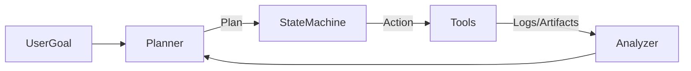
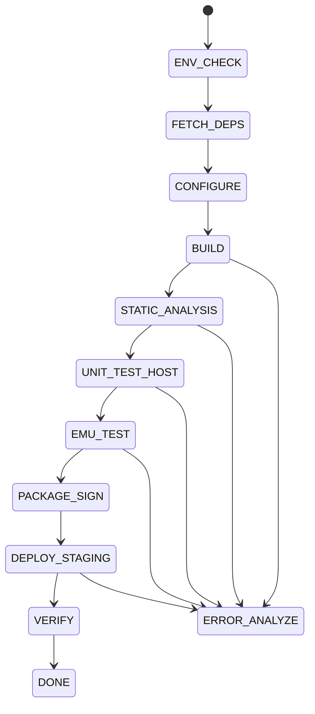
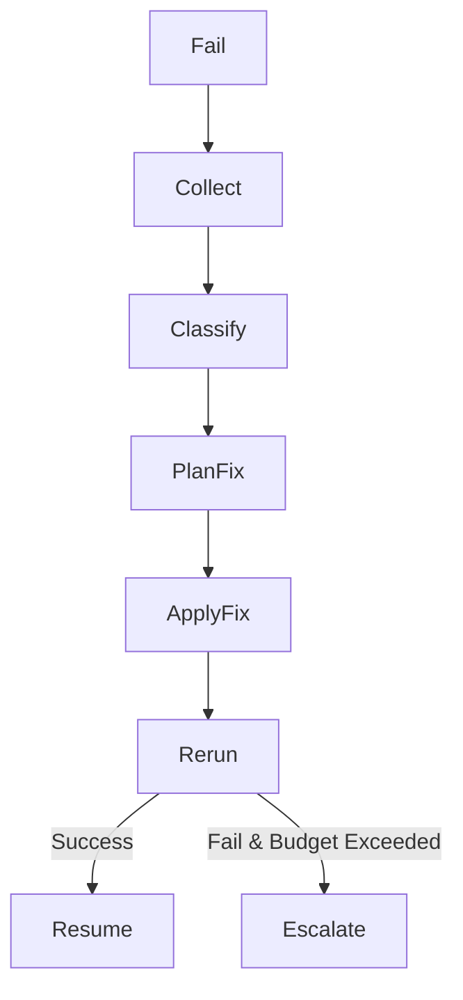

# OpenClaw + Qwen：Embedded 自動化工程流程 Agent（深度實戰版）

> 主題：build → test → lint → deploy  
> 重點：失敗自救（log 解析 → 修補 → retry）  
> 適用：Embedded Linux / RTOS / Cross-compile 團隊

---

## 目錄
1. 為什麼 Embedded 特別需要 Agent
2. Embedded CI/CD 的真實痛點（再細拆）
3. Agent 整體架構（分層設計）
4. 狀態機（State Machine）完整定義
5. 失敗自救核心：ERROR_ANALYZE 深度流程
6. Embedded 八大失敗類型（模式 → 對策）
7. Retry 與成本控制策略
8. 與 CI/CD 的三種整合方式
9. Embedded 團隊實際收益
10. Guardrails（避免燒板與翻車）
11. Embedded MVP 落地方案
12. 延伸與下一步

---

## 1. 為什麼 Embedded 特別需要 Agent

Embedded 專案的 CI/CD 失敗，**80% 不是業務邏輯錯誤**，而是：
- Toolchain / ABI / Sysroot
- 靜態庫與 link order
- 環境漂移（本地 OK，CI 爆）
- Emulator / 真板測試不穩

這些問題：
- 有高度「模式化」
- 非常耗工程師時間
- 非常適合交給 Agent 處理

---

## 2. Embedded CI/CD 的真實痛點（再細拆）

### 2.1 Toolchain / Sysroot 地獄
- gcc 9 vs gcc 12 行為不同
- glibc / musl 不相容
- hard-float / soft-float 不一致
- sysroot 路徑錯誤

### 2.2 Linker 與靜態庫
- undefined reference
- library 順序錯誤
- 缺少 --start-group / --end-group

### 2.3 測試困境
- unit test 在 host
- integration test 在 QEMU
- HIL 需要真板、串口、電源控制
- flaky test 非常常見

### 2.4 部署風險
- firmware 打包錯
- 簽章、版本、partition table
- OTA anti-rollback

---

## 3. Agent 整體架構（分層設計）

### 分層說明
- **Planner（Qwen）**：判斷問題、規劃修法
- **State Machine（OpenClaw）**：控制流程與 retry
- **Tools**：shell / git / python / flash / ota
- **Analyzer**：log 分析、錯誤分類

---

## 4. 狀態機（State Machine）完整定義

每個 state 定義：
- entry_actions
- success_transition
- failure_transition
- retry_budget
- artifacts（log / patch / report）

---

## 5. 失敗自救核心：ERROR_ANALYZE 深度流程

### 5.1 Collect
- 失敗 stage
- exit code
- 關鍵 log（最後 N 行 + pattern）
- toolchain 版本
- git diff

### 5.2 Classify（分類）
- deps / include
- link / abi
- env drift
- test flaky
- deploy risk

---

## 6. Embedded 八大失敗類型（模式 → 對策）

### 6.1 缺 header
- 修 include path
- 補 third-party lib
- patch CMakeLists.txt

### 6.2 Undefined reference
- nm / readelf 找 symbol
- 修 link order
- 補 -lxxx 或 start-group

### 6.3 ABI 不匹配
- 檢查 ELF class / arch
- 對齊 toolchain target triple

### 6.4 Sysroot 問題
- ldd 分析缺失 so
- 修 rpath / rootfs recipe

### 6.5 CI 環境漂移
- 固定 docker image
- pin toolchain artifact

### 6.6 QEMU 超時
- retry 判斷 flaky
- 提高 timeout
- 縮小測試集合

### 6.7 HIL 串口/燒錄失敗
- udev rule 檢查
- power cycle
- boot log signature 比對

### 6.8 OTA / 簽章錯誤
- 僅限 staging
- 產報告，需人工批准

---

## 7. Retry 與成本控制策略

| 類型 | 策略 |
|----|----|
| flaky test | 同策略 retry 1–2 次 |
| build/link | 修補後 retry |
| HIL | 限次 retry |
| deploy prod | 不自動 retry |

---

## 8. 與 CI/CD 的三種整合方式

### 8.1 CI 內嵌
- job fail → agent 修 → 再跑

### 8.2 外部修復服務
- webhook → agent → PR

### 8.3 內網 DevOps Bot
- 適合製造/醫療/保密環境

---

## 9. Embedded 團隊實際收益

- 大幅減少「看 log」時間
- 失敗可分類、可追蹤
- 修補可 review、可回放
- 工程師專注真正設計

---

## 10. Guardrails（避免燒板）

**允許自動**
- build / cmake / ci
- lint / test timeout

**需人工**
- production OTA
- partition / bootloader
- secret / key

---

## 11. Embedded MVP 落地方案

最小可用：
1. log parser + 分類
2. 修補建議 + patch
3. 分支重跑 build/test
4. 生成診斷報告（Jira 可貼）

---

## 12. 下一步可以擴充

- HIL power control
- 多板 farm
- OTA canary 策略
- 統計 flaky test

---

> 文件用途：設計、提案、內部培訓、實作藍圖
